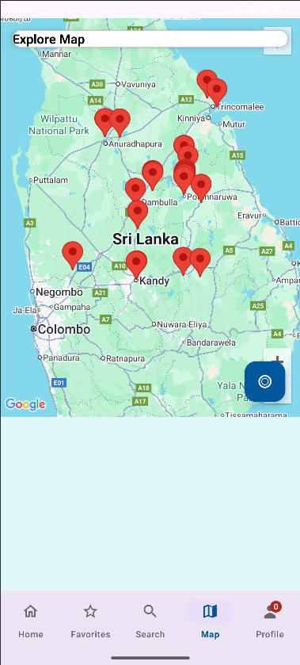
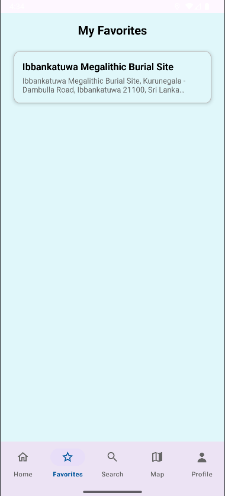
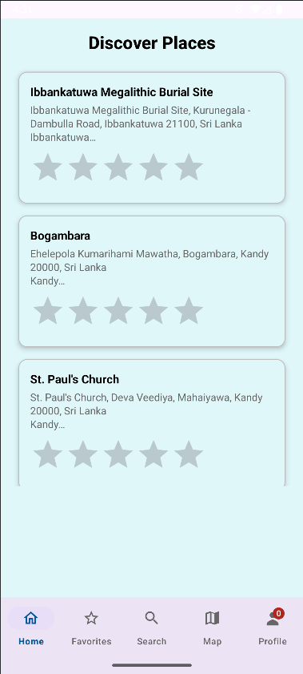
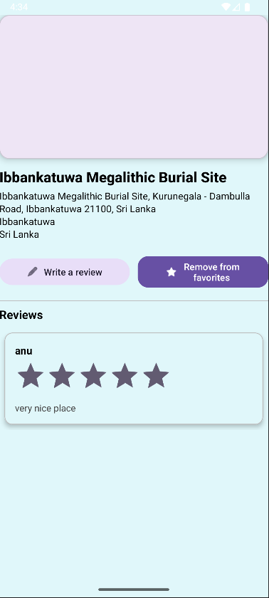
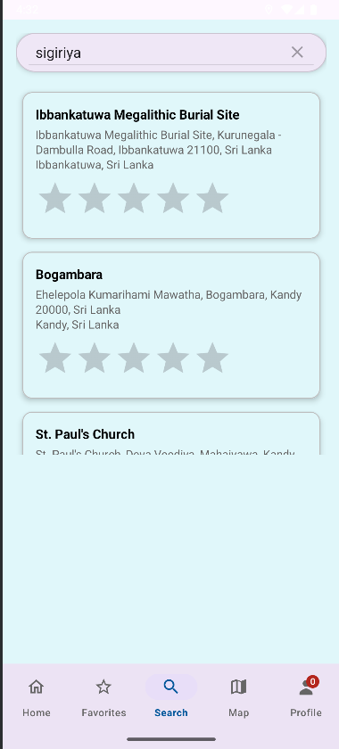

# 🌍 TravelGuider  

**TravelGuider** is a mobile application designed to make travel easier, more engaging, and personalized. From discovering new places to leaving your own reviews, TravelGuider combines maps, reviews, and personalization into one seamless app.  

---

## ✨ Features  

- **User Accounts & Guest Access**  
  - Create a new account or continue as a guest.  
  - Manage your profile and personal details.  

- **Explore Destinations**  
  - Browse locations with detailed descriptions, photos, and ratings.  
  - Search for specific places or filter by category.  

- **Reviews & Favorites**  
  - Leave reviews for destinations under your own profile.  
  - Save your favorite spots for quick access later.  

- **Interactive Map**  
  - View destinations on an integrated map.  
  - Navigate to places with ease.  

- **Tourist Tools**  
  - Bookmark must-visit locations.  
  - Personalized recommendations based on saved favorites.  

- **Offline Support (optional)**  
  - Access previously viewed locations even without internet.  

- **Admin & Staff Panels** *(future expansion)*  
  - Hotel and room management.  
  - Reservation tracking and reports.  

---

## 🛠️ Tech Stack  

- **Frontend**: Android (Kotlin)  
- **Backend/Database**: Room Database (local), Retrofit API (for remote data)  
- **UI/UX**: Material Design 3 with custom themes  

---

## 🚀 Getting Started  

1. Clone the repository:  
   ```bash
   git clone https://github.com/KisuraWSP/TravelGuider.git
   
   ```
## 📄 License

- This project is licensed under the MIT License – see the LICENSE file for details.


## 📸 Screenshots
  
  

  





